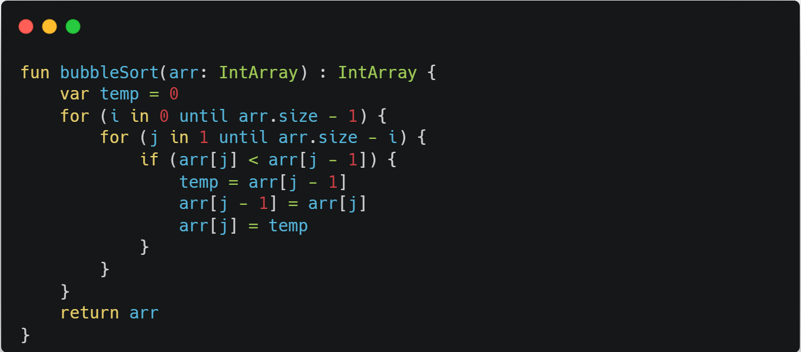

# 버블 정렬, Bubble Sort

## 개요

정렬 알고리즘 중 하나이다.
시간 복잡도가 O(n^2)로 상당히 느리지만, 코드가 단순하기 때문에 자주 사용된다. 원소의 이동이 거품이 수면으로 올라오는 듯한 모습을 보이기 때문에 지어진 이름이다. 이를 양방향으로 번갈아 수행하면 칵테일 정렬이 된다.

## 동작 방식

1. 배열의 두 수 a,b를 선택한다
2. 해당 두수가 정렬되있는지 검사한다
3. 정렬되어있지 않은 경우 두수를 바꾼다
4. 배열의 처음부터 끝까지 반복한다.

## 소스코드

## 복잡도
시간 복잡도가 O(n^2), 매번 바꿔줘야하기 때문에 정렬 알고리즘중 가장 느리다 

### 참고
https://ko.wikipedia.org/wiki/%EB%B2%84%EB%B8%94_%EC%A0%95%EB%A0%AC