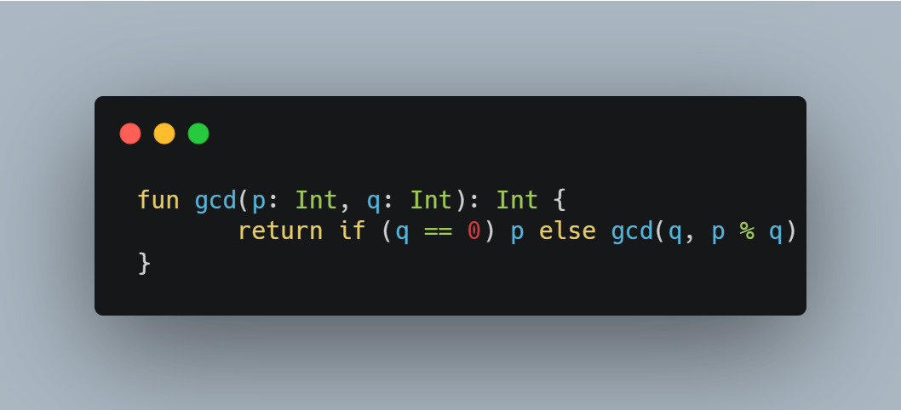

# 유클리드 호제법, Euclidean algorithm

## 개요

유클리드 알고리즘은 2개의 자연수 또는 정식(整式)의 최대공약수를 구하는 알고리즘의 하나이다.
 
a, b에 대해서 a를 b로 나눈 나머지를 r이라 하면(단, a>b), a와 b의 최대공약수는 b와 r의 최대공약수와 같다. 이 성질에 따라, b를 r로 나눈 나머지 r'를 구하고, 다시 r을 r'로 나눈 나머지를 구하는 과정을 반복하여 나머지가 0이 되었을 때 나누는 수가 a와 b의 최대공약수이다.
 

## 증명 (정수의 경우)

    여기서 모든 변수는 정수이다
    a>b
    gcd(a,b) = d
    
    a = b*q + r
    d*α = a
    d*β = b
    
    d는 최대공약수이기 때문에 α와 β는 최대공약수가 1인 서로소가 된다
    
    d*α = d*β*q + r
    r = d(α - β*q) = dp
    
    β와 p가 서로소라면 b와 r의 최대 공약수는 d가된다
    gcd(a,b) = gcd(b,r) = gcd(b,a-bq) =  gcd(b,a%b) = d

## 동작 방식

1. 입력으로 두 수 m,n(m>n)이 들어온다.
2. n이 0이라면, m을 출력하고 알고리즘을 종료한다.
3. m이 n으로 나누어 떨어지면, n을 출력하고 알고리즘을 종료한다.
4. 그렇지 않으면, m을 n으로 나눈 나머지를 새롭게 m에 대입하고, m과 n을 바꾸고 3번으로 돌아온다.

## 소스코드

## 복잡도
유클리드 호제법을 이용하여 나머지를 취하는 조작을, 최악의 경우라도 작은 수를 십진법으로 표시한 자리수의 5배를 반복하기 전에 최대공약수에 이른다(라메의 정리).

### 참고
https://ko.wikipedia.org/wiki/%EC%9C%A0%ED%81%B4%EB%A6%AC%EB%93%9C_%ED%98%B8%EC%A0%9C%EB%B2%95