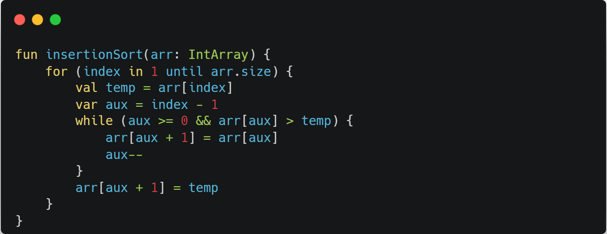

# 삽입 정렬, Insertion Sort

## 개요

자료 배열의 모든 요소를 앞에서부터 차례대로 이미 정렬된 배열 부분과 비교하여, 자신의 위치를 찾아 삽입함으로써 정렬을 완성하는 알고리즘이다.
 
배열이 길어질수록 효율이 떨어진다. 다만, 구현이 간단하다는 장점이 있다.
 
선택 정렬이나 거품 정렬과 같은 O(n2) 알고리즘에 비교하여 빠르며, 안정 정렬이고 in-place 알고리즘이다.

## 동작 방식

1. 인댁스 i번의 값을 뒤의 i-1번의 값과 비교한다(i는 1이상)
2. i번의 값이 작다면 i-1번의 값을 i에 삽입후 i-n(n은 i이하)번과 반복
3. i번의 값이 크다면 i-n번에 i번의 값을 삽입합니다. 

## 소스코드

## 복잡도
n개의 데이터가 있을 때, 최악의 경우,O(n^2) = n(n-1)/2

### 참고
https://ko.wikipedia.org/wiki/%EC%82%BD%EC%9E%85_%EC%A0%95%EB%A0%AC