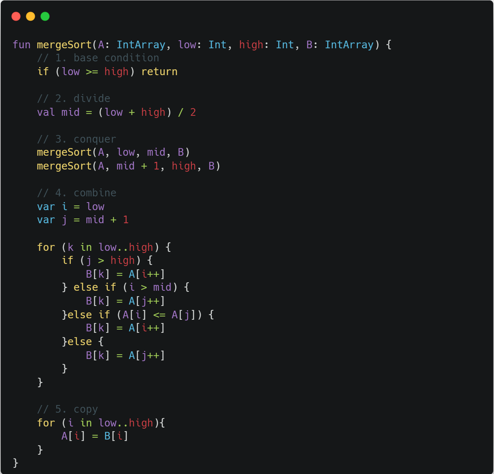

# 합 병 정렬, Merge Sort

## 개요

## 동작 방식

### n-way 합병 정렬의 경우

1. 정렬되지 않은 리스트를 각각 하나의 원소만 포함하는 n개의 부분리스트로 분할한다. (한 원소만 든 리스트는 정렬된 것과 같으므로)
2. 부분리스트가 하나만 남을 때까지 반복해서 병합하며 정렬된 부분리스트를 생성한다. 마지막 남은 부분리스트가 정렬된 리스트이다.

### 하향식 2-way 합병 정렬의 경우

1. 리스트의 길이가 1 이하이면 이미 정렬된 것으로 본다. 그렇지 않은 경우에는
2. 분할(divide): 정렬되지 않은 리스트를 절반으로 잘라 비슷한 크기의 두 부분 리스트로 나눈다.
3. 정복(conquer): 각 부분 리스트를 재귀적으로 합병 정렬을 이용해 정렬한다.
4. 결합(combine): 두 부분 리스트를 다시 하나의 정렬된 리스트로 합병한다. 이때 정렬 결과가 임시배열에 저장된다.
5. 복사(copy): 임시 배열에 저장된 결과를 원래 배열에 복사한다.

## 소스코드

## 복잡도
퀵 정렬은 n개의 데이터를 정렬할 때, 최악의 경우에는 O(n^2)번의 비교를 수행하고, 평균적으로 O(n log n)번의 비교를 수행한다.

### 참고
https://ko.wikipedia.org/wiki/%ED%95%A9%EB%B3%91_%EC%A0%95%EB%A0%AC