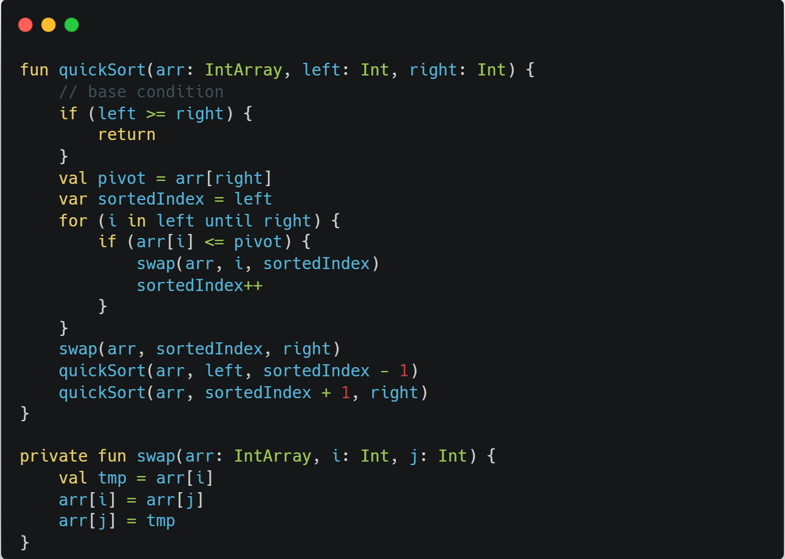

# 퀵 정렬, Quick Sort

## 개요

다른 원소와의 비교만으로 정렬을 수행하는 비교 정렬에 속한다.
 
퀵 정렬의 내부 루프는 대부분의 컴퓨터 아키텍처에서 효율적으로 작동하도록 설계되어 있고(그 이유는 메모리 참조가 지역화되어 있기 때문에 CPU 캐시의 히트율이 높아지기 때문이다.), 대부분의 실질적인 데이터를 정렬할 때 제곱 시간이 걸릴 확률이 거의 없도록 알고리즘을 설계하는 것이 가능하다. 또한 매 단계에서 적어도 1개의 원소가 자기 자리를 찾게 되므로 이후 정렬할 개수가 줄어든다. 때문에 일반적인 경우 퀵 정렬은 다른 O(n log n) 알고리즘에 비해 훨씬 빠르게 동작한다. 이러한 이유로 퀵소트(빠른정렬)라는 이름의 기원이 되었다. 그리고 퀵 정렬은 정렬을 위해 평균적으로 O(log n)만큼의 memory를 필요로한다. 이는 재귀적 호출로 발생하는 것이며, 최악의 경우 O(n)의 공간복잡도를 보인다.

## 동작 방식

1. 리스트 가운데서 하나의 원소를 고른다. 이렇게 고른 원소를 피벗이라고 한다.
2. 피벗 앞에는 피벗보다 값이 작은 모든 원소들이 오고, 피벗 뒤에는 피벗보다 값이 큰 모든 원소들이 오도록 피벗을 기준으로 리스트를 둘로 나눈다. 이렇게 리스트를 둘로 나누는 것을 분할이라고 한다. 분할을 마친 뒤에 피벗은 더 이상 움직이지 않는다.
3. 분할된 두 개의 작은 리스트에 대해 재귀(Recursion)적으로 이 과정을 반복한다. 재귀는 리스트의 크기가 0이나 1이 될 때까지 반복된다.

## 소스코드

## 복잡도
퀵 정렬은 n개의 데이터를 정렬할 때, 최악의 경우에는 O(n^2)번의 비교를 수행하고, 평균적으로 O(n log n)번의 비교를 수행한다.

### 참고
https://ko.wikipedia.org/wiki/%ED%80%B5_%EC%A0%95%EB%A0%AC